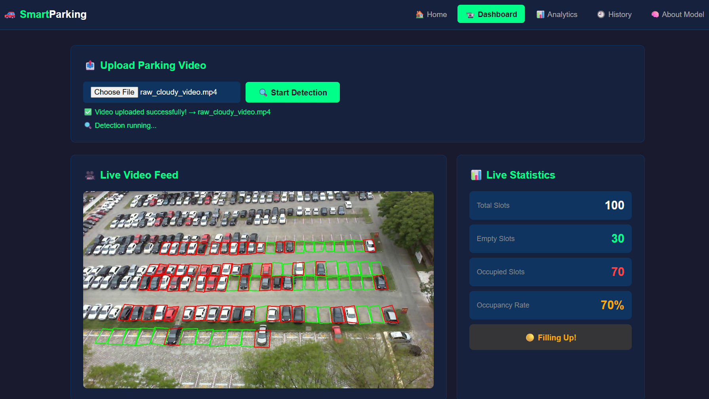
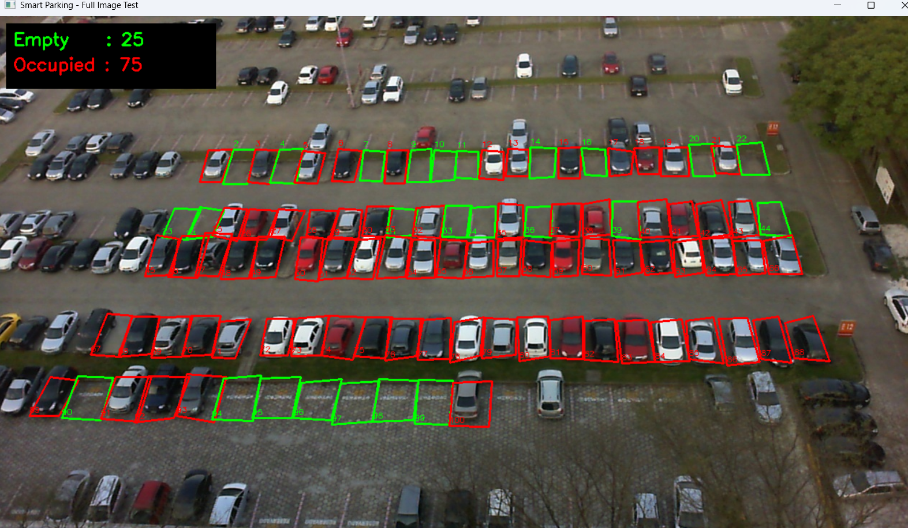
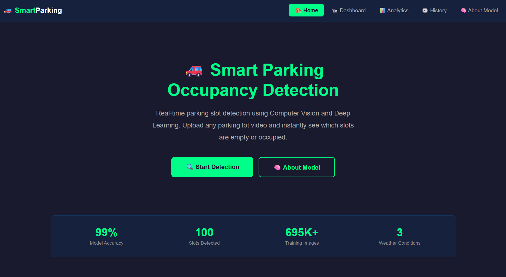
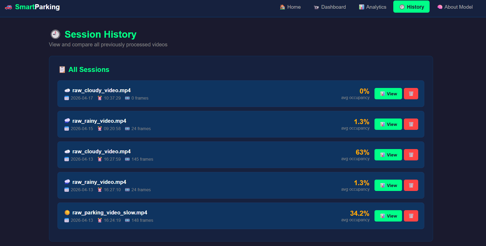
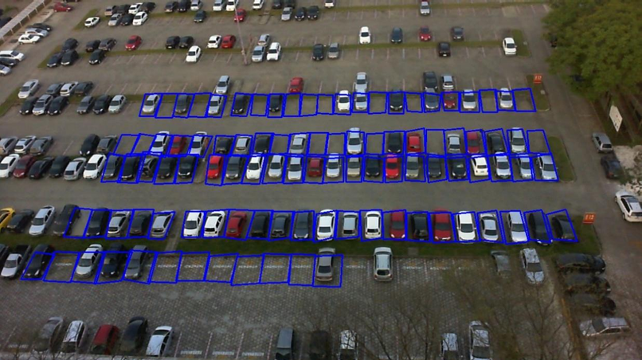
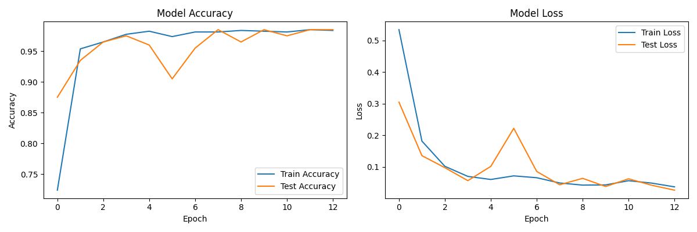
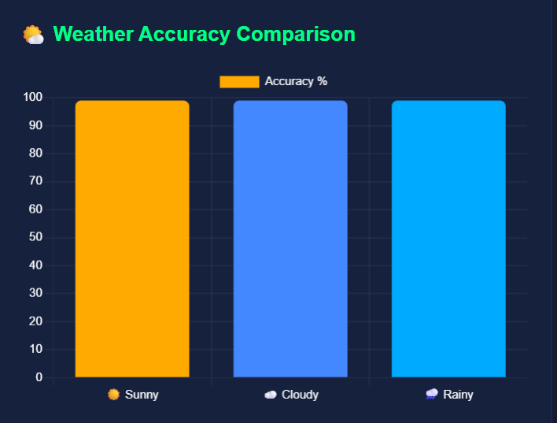
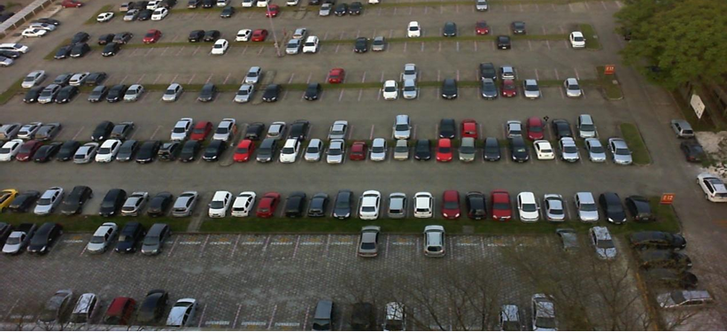

# 🚗 Smart Parking Occupancy Detection System

<div align="center">


**Real-time parking lot occupancy detection using Computer Vision and Deep Learning**

[🔍 Features](#-features) • [🖼️ Demo](#️-demo) • [🧠 CNN Architecture](#-cnn-architecture) • [📁 Project Structure](#-project-structure) • [⚙️ Installation](#️-installation) • [🚀 Usage](#-usage) • [📊 Results](#-results) • [👥 Authors](#-authors)

</div>

---

## 📌 About the Project

The **Smart Parking Occupancy Detection System** is a full end-to-end deep learning application that automatically detects whether parking slots are **empty 🟩** or **occupied 🟥** from a parking lot video feed.

The system uses a **Convolutional Neural Network (CNN)** trained on the PKLot dataset to classify each of **100 parking slots per frame** in real time. It provides a complete **Flask web dashboard** with live video streaming, analytics, and session history — all backed by a **SQLite database**.

> 🎓 Developed as a B.Tech final year project at **RGUKT RK Valley, Andhra Pradesh**

---

## 🖼️ Demo

### Live Detection Dashboard

The dashboard streams the uploaded video frame-by-frame, drawing a live overlay on every one of the 100 slots — green for empty, red for occupied — alongside a real-time statistics panel.



### Detection Output Close-Up

Each frame is annotated with per-slot bounding boxes and a running empty/occupied counter in the corner.



### Home Page



### Session History

Every processed video is logged with timestamp, frame count, and average/peak/minimum occupancy rate, and can be revisited or deleted.



---

## ✨ Features

| Feature | Description |
|---------|-------------|
| 🧠 **CNN Model** | Custom 3-layer CNN with 99% accuracy |
| 📹 **Live Video Detection** | Real-time slot classification at 2 FPS |
| 🌦️ **Weather Robust** | Works on Sunny, Cloudy, and Rainy conditions |
| 🖥️ **Flask Dashboard** | 5-page web interface with live MJPEG streaming |
| 📊 **Analytics** | Chart.js graphs for training history and weather accuracy |
| 🗄️ **Session History** | SQLite database stores all detection sessions |
| 🎯 **100 Slots** | Detects all 100 parking slots per frame simultaneously |
| ⚡ **Fast Inference** | Runs on CPU — no GPU required |

---

## 🧠 CNN Architecture

```
Input Image (64×64×3)
        ↓
Conv2D (32 filters, 3×3, ReLU)   → Detect edges and textures
        ↓
MaxPooling2D (2×2)
        ↓
Conv2D (64 filters, 3×3, ReLU)   → Detect shapes and patterns
        ↓
MaxPooling2D (2×2)
        ↓
Conv2D (128 filters, 3×3, ReLU)  → Detect vehicle presence
        ↓
MaxPooling2D (2×2)
        ↓
Flatten
        ↓
Dense (128 neurons, ReLU)
        ↓
Dropout (0.5)                     → Prevent overfitting
        ↓
Dense (1 neuron, Sigmoid)         → Output: 0 = Empty | 1 = Occupied
```

**Training Configuration:**

| Parameter | Value |
|-----------|-------|
| Optimizer | Adam |
| Loss Function | Binary Cross-Entropy |
| Batch Size | 32 |
| Max Epochs | 20 |
| Early Stopping | Patience = 3 |
| Actual Stop Epoch | **13** |
| Final Accuracy | **99%** |

### How Slot Detection Works

Rather than running object detection on every frame, slot positions are pre-defined as 100 bounding polygons in `slots.json` (realistic for a fixed-camera deployment). Each frame is cropped at these coordinates, resized to 64×64, and passed through the CNN individually.



**Preprocessing pipeline applied to every slot crop:**

<table>
<tr>
<td align="center"><br><b>Empty slot (64×64)</b></td>
<td align="center"><br><b>Occupied slot (64×64)</b></td>
</tr>
</table>

---

## 📊 Results

### ✅ CNN Training Results

| Epoch | Train Accuracy | Val Accuracy | Val Loss |
|-------|---------------|--------------|----------|
| 1 | 65.2% | 68.0% | 0.612 |
| 5 | 91.8% | 90.3% | 0.231 |
| 9 | 97.8% | 97.2% | 0.089 |
| 13 (Stop) | **99.2%** | **99.0%** | **0.028** |



### 🌦️ Weather Condition Accuracy

| Weather Condition | Total Slots | Correctly Classified | Accuracy |
|-------------------|-------------|---------------------|----------|
| ☀️ Sunny | 100 per frame | 99 per frame | **99%** |
| ☁️ Cloudy | 100 per frame | 99 per frame | **99%** |
| 🌧️ Rainy | 100 per frame | 99 per frame | **99%** |



### 🎯 Other Key Results

| Metric | Result |
|--------|--------|
| Single Slot Prediction Confidence | **99.82%** |
| Full Image Test (100 slots) | **99/100 correct** |
| Training Time (CPU) | ~4 minutes |
| Video Processing Rate | 2 FPS (stable) |
| Live MJPEG Streaming | ✅ Smooth |

---

## 📁 Project Structure

```
smart-parking-occupancy-detection/
│
├── 📄 app.py                    ← Flask backend + database + detection
├── 📄 slots.json                ← 100 parking slot coordinates
├── 📄 requirements.txt          ← Python dependencies
├── 📄 runtime.txt               ← Python version specification
│
├── 📁 models/
│   └── parking_model.h5         ← Trained CNN model (99% accuracy)
│
├── 📁 templates/
│   ├── base.html                ← Navbar + common layout
│   ├── home.html                ← Landing page
│   ├── dashboard.html           ← Upload + live detection
│   ├── analytics.html           ← Weather + training graphs
│   ├── history.html             ← Session history
│   └── about.html               ← CNN architecture info
│
├── 📁 outputs/
│   ├── weather_accuracy.json    ← Weather test results
│   └── training_graph.png       ← CNN training curves
│
├── 📁 readme_assets/            ← Screenshots used in this README
│
└── 📁 development/              ← Step-by-step development scripts
    ├── step1_opencv_basics.py
    ├── step2_slot_marking.py
    ├── step3_preprocessing.py
    ├── step4_train_cnn.py
    ├── step5_predict.py
    ├── step6_full_image_test.py
    ├── step6_create_video.py
    ├── step7_live_detection.py
    ├── live_detection_cloudy.py
    └── live_detection_rainy.py
```

---

## 🔧 Tech Stack

| Technology | Purpose |
|------------|---------|
| **Python 3.12** | Primary programming language |
| **TensorFlow 2.x** | Deep learning backend |
| **Keras** | CNN model building and training |
| **OpenCV** | Video processing, slot extraction, annotation |
| **Flask** | Web dashboard and MJPEG streaming |
| **SQLite** | Session and frame-level data storage |
| **NumPy** | Array operations and preprocessing |
| **scikit-learn** | Train/test split and metrics |
| **Chart.js** | Interactive analytics charts |
| **Jinja2** | HTML templating |

---

## 📋 Dataset — PKLot



| Property | Details |
|----------|---------|
| **Name** | PKLot (Parking Lot Dataset) |
| **Total Images** | 695,851 |
| **Source** | Federal University of Parana, Brazil |
| **Weather Conditions** | Sunny, Cloudy, Rainy |
| **Labels** | Empty / Occupied |
| **Used for Training** | 1,000 images (500 empty + 500 occupied) |
| **Train/Test Split** | 800 / 200 (80:20 ratio) |

📎 Dataset: [PKLot Official Page](https://web.inf.ufpr.br/vri/databases/parking-lot-database/)

---

## ⚙️ Installation

### Prerequisites
- Python 3.11 or 3.12
- pip package manager

### Steps

**1. Clone the repository**
```bash
git clone https://github.com/Yasodha-Krishna-Sajja/smart-parking-occupancy-detection.git
cd smart-parking-occupancy-detection
```

**2. Create a virtual environment (recommended)**
```bash
python -m venv venv
venv\Scripts\activate        # Windows
source venv/bin/activate     # Mac/Linux
```

**3. Install dependencies**
```bash
pip install -r requirements.txt
```

**4. Run the Flask app**
```bash
python app.py
```

**5. Open in browser**
```
http://127.0.0.1:5000
```

---

## 🚀 Usage

### Step 1 — Open the Dashboard
Navigate to `http://127.0.0.1:5000/dashboard`

### Step 2 — Upload a Parking Lot Video
Click **"Choose File"** and upload one of the test videos:
- `raw_parking_video_slow.mp4` → Sunny conditions
- `raw_cloudy_video.mp4` → Cloudy conditions
- `raw_rainy_video.mp4` → Rainy conditions

### Step 3 — Start Detection
Click **"Start Detection"** to begin real-time slot classification.

### Step 4 — View Live Results
- 🟩 **Green rectangles** = Empty slots
- 🟥 **Red rectangles** = Occupied slots
- Live statistics update every second

### Step 5 — Explore Other Pages

| Page | URL | What You See |
|------|-----|--------------|
| 🏠 Home | `/` | Landing page with project overview |
| 📹 Dashboard | `/dashboard` | Live detection + statistics |
| 📊 Analytics | `/analytics` | Training graphs + weather accuracy |
| 📅 History | `/history` | All previous detection sessions |
| ℹ️ About | `/about` | CNN architecture details |

---

## 🌐 Flask API Routes

| Route | Method | Description |
|-------|--------|-------------|
| `/` | GET | Home page |
| `/dashboard` | GET | Main dashboard |
| `/analytics` | GET | Analytics page |
| `/history` | GET | Session history |
| `/about` | GET | Model info |
| `/upload` | POST | Upload video file |
| `/detect` | POST | Start detection thread |
| `/video_feed` | GET | MJPEG live stream |
| `/stats` | GET | Current frame stats JSON |
| `/status` | GET | Processing status JSON |
| `/sessions` | GET | All sessions JSON |
| `/session/<id>` | GET | Single session detail |
| `/session/<id>/delete` | DELETE | Delete session |

---

## 🗄️ Database Schema

### Sessions Table
```sql
CREATE TABLE sessions (
    id          INTEGER PRIMARY KEY,
    video_name  TEXT,
    date        TEXT,
    time        TEXT,
    total_frames INTEGER,
    avg_empty   REAL,
    avg_occupied REAL,
    avg_rate    REAL,
    peak_rate   REAL,
    min_rate    REAL
);
```

### Frames Table
```sql
CREATE TABLE frames (
    id          INTEGER PRIMARY KEY,
    session_id  INTEGER,
    frame_no    INTEGER,
    empty       INTEGER,
    occupied    INTEGER,
    rate        REAL,
    FOREIGN KEY (session_id) REFERENCES sessions(id)
);
```

---

## 🖥️ System Requirements

| Component | Specification |
|-----------|--------------|
| **OS** | Windows / Linux / macOS |
| **Python** | 3.11 or 3.12 |
| **RAM** | Minimum 4GB (8GB recommended) |
| **CPU** | Any modern processor |
| **GPU** | Not required (CPU inference) |
| **Storage** | ~500MB (model + dependencies) |

> ✅ Tested on **ASUS VivoBook M1603QA** — AMD Ryzen 7, 8GB RAM

---

## 🔮 Future Enhancements

- 📡 **Live IP Camera / RTSP Stream** integration
- 🤖 **Transfer Learning** with MobileNetV2 / ResNet50
- 🧩 **Automatic Slot Detection** using segmentation (U-Net / Mask R-CNN) instead of manual JSON coordinates
- 📱 **Mobile Application** for real-time parking availability
- 🌙 **Night-time detection** with low-light enhancement
- ☁️ **Cloud deployment** for multi-parking-lot support
- 📈 **Predictive Analytics** using LSTM for occupancy forecasting
- 🔔 **Alert System** for threshold-based notifications
- 🔐 **User Authentication** for multi-tenant deployments

---

## 👥 Authors

| Name | Roll Number |
|------|------------|
| **S. Yasodha Krishna** | R210045 |
| **L. Sandhya** | R210390 |

**Guide:** Dr. B. Nagaraja Naik, Ph.D. — Assistant Professor, CSE
**Institution:** Rajiv Gandhi University of Knowledge Technologies (RGUKT), RK Valley, Y.S.R. Kadapa, Andhra Pradesh — 516330

---

## 📚 References

1. de Almeida et al. (2015). PKLot — A robust dataset for parking lot classification. *Expert Systems with Applications*, 42(11), 4937–4949.
2. Amato et al. (2017). Deep learning for decentralized parking lot occupancy detection. *Expert Systems with Applications*, 72, 327–334.
3. Chollet, F. (2021). *Deep Learning with Python* (2nd ed.). Manning Publications.
4. [TensorFlow Documentation](https://www.tensorflow.org/api_docs)
5. [OpenCV Documentation](https://docs.opencv.org)
6. [PKLot Dataset](https://web.inf.ufpr.br/vri/databases/parking-lot-database/)

---

<div align="center">

⭐ **If you found this project useful, please give it a star!** ⭐

Made with ❤️ by S. Yasodha Krishna & L. Sandhya — RGUKT RK Valley

</div>
